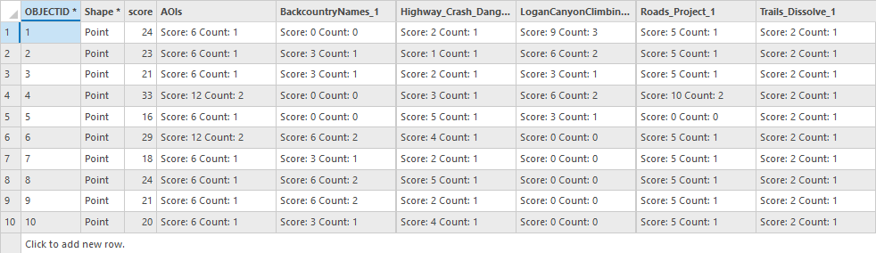

# Logan Canyon Viewshed Score Calculator Toolbox

## Overview

This tool calculates visibility (viewsheds) from a set of input objects and assigns scores based on spatial intersections with other feature classes. It accepts the following inputs:

* **Observer Inputs** (e.g., cell towers, lamp posts, signs, buildings, trails/line features)
* **Elevation Raster**
* **Estimate DEM Boolean**
* **Land Cover Data**
* **Tower Range** (distance and units)
* **Output Geodatabase**
* **Scoring Parameter Layers** (with numeric “score” fields)
* **Observer Height** (height and units)

Each viewshed is calculated individually, converted to a polygon, and used to perform spatial joins with scoring layers. Scores are aggregated and recorded in the attribute table of the input points.

---

## Data Preparation

Before running the tool:

* **Scoring Layers** must have a numeric `score` field.

  * If a viewshed intersects multiple features with different scores, the **highest score** is retained.
  * If all features share the same score, the tool will **count** the number of intersected features and multiply by the score.

    * *Example*: If a road layer has a score of 2 and a viewshed intersects 5 roads, the resulting score is 10.

* **Tower Range** limits viewshed extent from each point. This simulates realistic signal limitations (e.g., 5G towers range \~1–3 miles).

* **Viewsheds** are computed based on the resolution of the input DEM (e.g., a 10m raster results in 10x10m analysis cells).

* **Observer Points** must contain valid geometry. Invalid geometries or null shapes will cause the tool to fail.

* **Coordinate System**: All inputs should be projected to the same coordinate system. This ensures consistent units. (Support for dynamic unit conversion is planned.)

---

## Using the Tool

1. Provide the required input layers and parameters.
2. Run the tool. Processing time depends on machine specifications and number of input points.

> **Performance Benchmark**
> On an Intel Core i7 with 16GB RAM and 6GB GPU:
>
> * 10 observer points: \~5 minutes
> * 55 observer points: \~40 minutes

> **Note:**
>
> * Progress and messages are shown in the **Details pane**.
> * The majority of runtime is spent generating viewsheds.
> * Final outputs include the input points (with updated scores) and generated viewshed polygons.

---

## Understanding the Output

The resulting table includes:

* One column per scoring parameter, showing the count of intersected features and total score.
* A **final score** column summarizing the total score per observer point.

> **Interpretation Example:**
>
> * **High Score = Good**: For maximizing cell tower coverage.
> * **Low Score = Good**: For minimizing visibility of a structure.

Scoring priorities are user-defined and should reflect project goals.

---

## Limitations and Considerations

* **Input Data Quality**: Ensure clean geometry and reliable attribute data. Inaccurate inputs will produce unreliable results.

* **Subjectivity in Scoring**: Score values are user-assigned and subjective. Flexibility is intentional to support varying project goals.

  * *Example*: One project may prioritize trail visibility; another may prioritize avoiding recreation areas.

* **Elevation Data**: DEM accuracy and resolution impact results. Choose a resolution that matches the project’s precision needs.

  * *Example*: 1m DEMs may be overkill for cell tower planning, but necessary for analyzing lamp post visibility.

* **Generalization Warning**: This tool provides approximations. Results are best used for **big-picture planning**, not fine-scale engineering.

---

## Data Credits

* **United States Geological Survey (USGS)** (2022 & 2024). DEM – [usgs.gov](https://www.usgs.gov/the-national-map-data-delivery)
* **Highway Safety Department** – Logan Crash Data
* **Utah Geospatial Resource Center (UGRC)** – Roads and Trails Dataset
* **Mountain Project** – Logan Canyon Climbing Locations - (https://www.mountainproject.com)
* **Dallin Moon (2023)** – Backcountry Names & Existing Structures Datasets

---

## Future Improvements

* Support for **line features** as observer input
* More **user-friendly scoring interface**
